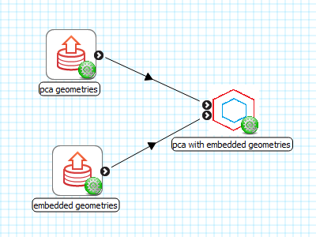
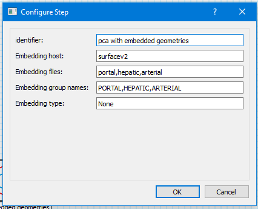
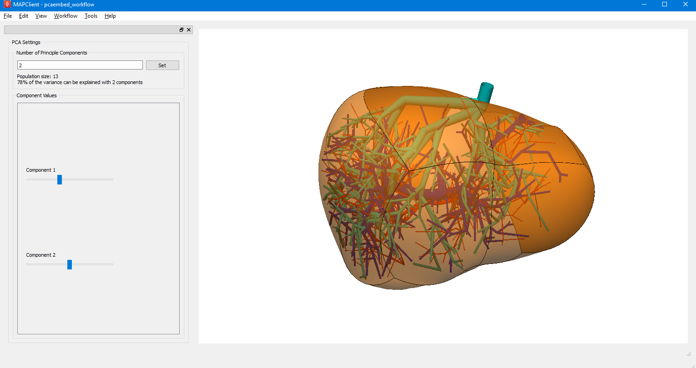

zincpcaembedded
===============

The zincpcaembedded step is a plugin for the MAP Client application. Similar to (https://github.com/hyu754/mapclientplugins.zincpcastep), this plugin performs pca on a set of geometries, can also embed geometries internally.

Requirements
=======
* numpy

Setup
=======
* Add two *Directory Chooser* steps: 

  1. Choose the first to be to the location of the geometries for PCA analysis.
  2. Choose the second to be the location for the embedding geometries.
  
    * In this directory you should have the *host* mesh, and the meshes that you want to embed.
  

* Then add a *zincpcaembeddedstep* step.

Configuration
=======
* Embedding host : the geometry in which the geometries will be embedded inside. 
* Embedding files: file names to be embedded, each file will have *.exnode, .exelem* files associated with it.
* Embedding group names: the cmiss group names of the embedding geometries
* Embedding type: *Not used*

Example
-------

* Configure pca directory to be:  YOUR_PATH/example_geometries/twocubes 
* Configure embedding directory to be:  YOUR_PATH/example_geometries/emedding
* Configure zincpcaembeddedstep with the information in the above image.

